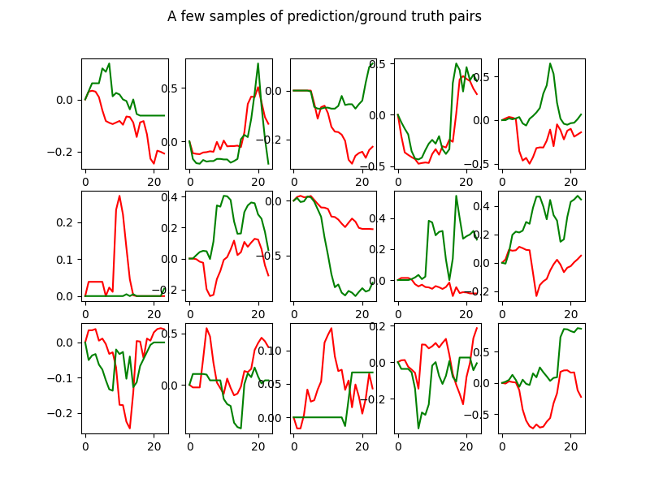

# Hackathon at Semana Franco-Mexicana de IA

This Hackathon focus on mobility data from Ciudad de México (México) and Lyon (France). These two cities, as many other large cities in the world, have implemented a bike sharing system, for a few years now, and they share data about the system usage. This can give us great insights on mobility patterns within the cities!

The data are historical data from the two bike sharing systems and have been collected from these two pages:
* https://data.grandlyon.com/portail/fr/jeux-de-donnees/stations-velo-v-de-la-metropole-de-lyon---disponibilites-temps-reel/donnees (Lyon)
* https://ecobici.cdmx.gob.mx/datos-abiertos/ (CdMX)

The raw data are rather distinct, but we have collected them and reformatted them so that you can do some comparisons. In Lyon, the original data give a status of the number of available bikes at a station every 10mn or so. In CdMX, the historical data are the individual transactions, i.e. the events when a user takes a bike from a rack or leaves it after use. The two scripts lyon_download.py and cdmx_download.py download these data, and reformat them in a hourly base (averaging the numbers for Lyon and summing the inputs and outputs in CdMX), and annotate them with weekday, holiday flags and weather data (from [meteostat](https://dev.meteostat.net/python/#installation)).  

The Hackathon will have two challenges around these data:

* A **data exploration and visualization challenge**: This is a free challenge, where we provide you cleaned data from the two open data systens in CdMX and Lyon. You are free to use whatever resource, data analysis tool or visualization tool to provide some interesting comparative insight about the two cities. As an example, you could cluster the bike stations into groups with similar time evolution of the bike availability (i.e., residential areas, business areas, entertainment areas...). 

* A **prediction task**: Given geographical and weather conditions, what should be the time evolution of the bike availability? As a baseline, we provide you with a very simple regressor to do that, the KNN regressor (in the file lyon_starter.py).

 
