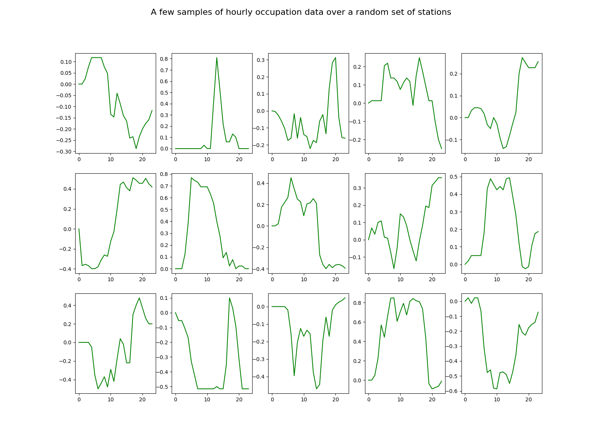

# Hackathon at Semana Franco-Mexicana de IA

This Hackathon focus on mobility data from Ciudad de México (México) and Lyon (France). These two cities, as many other large cities in the world, have implemented a bike sharing system, for a few years now, and they share data about the system usage. This can give us great insights on mobility patterns within the cities!

The data are historical data from the two bike sharing systems and have been collected from these two pages:
* https://data.grandlyon.com/portail/fr/jeux-de-donnees/stations-velo-v-de-la-metropole-de-lyon---disponibilites-temps-reel/donnees (Lyon)
* https://ecobici.cdmx.gob.mx/datos-abiertos/ (CdMX)

The raw data are rather distinct, but we have collected them and reformatted them so that you can do some comparisons. In Lyon, the original data give a status of the number of available bikes at a station every 10mn or so. In CdMX, the historical data are the individual transactions, i.e. the events when a user takes a bike from a rack or leaves it after use. The two scripts lyon_download.py and cdmx_download.py download these data, and reformat them in a hourly base (averaging the numbers for Lyon and summing the inputs and outputs in CdMX), and annotate them with weekday, holiday flags and weather data (from [meteostat](https://dev.meteostat.net/python/#installation)).  

The Hackathon will have two challenges around these data:

* A **data storytelling challenge**: This is a free challenge, where we provide you cleaned data from the two open data systens in CdMX and Lyon and you have to tell us a *story* about these data. You are free to use whatever resource, data analysis tool or visualization tool to provide some interesting comparative insight about the two cities. As an example, you could cluster the bike stations into groups with similar time evolution of the bike availability and identify what could be residential areas, business areas, entertainment areas.... 

* A **prediction task**: Given geographical and weather conditions, tell us what could be the time evolution of the bike availability? As a baseline, we provide you with a very simple regressor to do that, the KNN regressor (in the file lyon_starter.py).

A short description of the content of this repository:

* [data/](https://github.com/jbhayet/semanaia-hackathon/tree/main/data): contains some of the pre-processed data about stations, geographical zones within the cities, and processed series with which you can start the challenge.
* [lyon_download.py](https://github.com/jbhayet/semanaia-hackathon/blob/main/lyon_download.py) and [cdmx_download.py](https://github.com/jbhayet/semanaia-hackathon/blob/main/cdmx_download.py): you should *not* use these scripts during the Hackathon, as they download a huge quantity of data from the Lyon and CdMX open data websites, but they are here so that you can know how the data are pre-processed.
* [generate_zones.py](https://github.com/jbhayet/semanaia-hackathon/blob/main/generate_zones.py): this script uses the geographical data from the french communes delimitations, the 'colonias' delimitations in CdMX and uses them to produce (somewhat arbitrarily in the case of CdMX) a set of around 20-30 zones per city.
* [lyon_generate_series.py](https://github.com/jbhayet/semanaia-hackathon/blob/main/lyon_generate_series.py) and [cdmx_generate_cities.py](https://github.com/jbhayet/semanaia-hackathon/blob/main/cmdx_generate_series.py): these two scripts use the cleaned, downloaded data to produce 24-h series of occupation data per station and date. These are the data you are provided with for the hackathon.
 
Use this Jupyter notebook as your starting point, either locally or through Google colab:

* [Download notebook](https://github.com/jbhayet/semanaia-hackathon/blob/main/IA_Hackathon_starter.ipynb)
* [Run on Colab](https://colab.research.google.com/github/jbhayet/semanaia-hackathon/blob/main/IA_Hackathon_starter.ipynb)